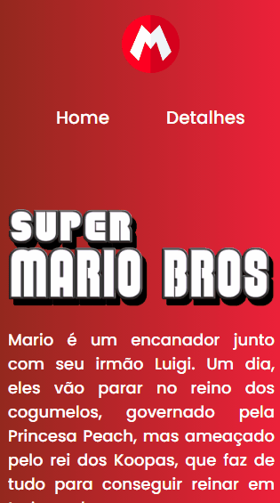

# Super Mario Bros | O Filme

Projeto desenvolvido durante a Semana do Programador do Zero ao Contratado do <a href="https://github.com/devemdobro">Dev em Dobro</a>, onde a proposta era a criação de uma landing page do filme. Esse projeto segue fielmente o projeto proposto pelos gêmeos, o meu personalizado está disponível <a href="https://projeto-wchampions-league.vercel.app/">aqui</a>!

## 🔧 Tecnologias
- HTML
- CSS
- JS
- Git
- Github

## 🔗 Acesso

Para acessar o projeto, basta <a href="https://github.com/ssschneider/projeto-mario">clicar aqui </a>!

## 💻 Demo

| Versão Desktop  | Versão Mobile |
| -------------- |-------------- |
| |  |